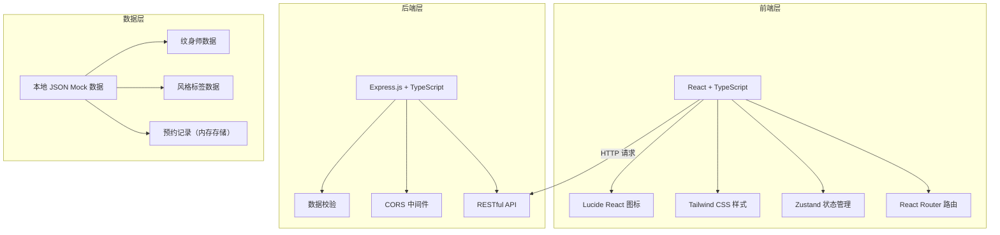
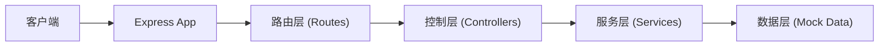

## 1. 架构设计



## 2. 技术描述

- **前端**：React@18 + TypeScript + Vite + Tailwind CSS@3 + Zustand + React Router DOM + Lucide React
- **后端**：Express.js@4 + TypeScript + CORS
- **数据层**：本地 Mock JSON 数据 + 内存存储（无需数据库，便于演示）
- **初始化工具**：vite-init 全栈模板 react-express-ts

## 3. 路由定义

| 前端路由 | 用途 |
|----------|------|
| / | 首页 - 作品瀑布流 + 标签云 + 筛选 |
| /artist/:id | 纹身师详情页 |
| /favorites | 收藏管理页 |

| 后端API路由 | 方法 | 用途 |
|-------------|------|------|
| /api/artists | GET | 获取纹身师列表（支持风格/地区/价位筛选） |
| /api/artists/:id | GET | 获取单个纹身师详情 |
| /api/styles | GET | 获取所有风格标签 |
| /api/favorites | GET | 获取收藏列表（本地存储模拟） |
| /api/favorites/:artistId | POST | 收藏纹身师 |
| /api/favorites/:artistId | DELETE | 取消收藏 |
| /api/bookings | POST | 提交预约咨询 |
| /api/regions | GET | 获取地区列表 |

## 4. API 定义

```typescript
// 纹身师
interface Artist {
  id: string;
  name: string;
  avatar: string;
  bio: string;
  region: string;
  city: string;
  priceMin: number;
  priceMax: number;
  priceUnit: string;
  styles: string[];
  works: Work[];
  createdAt: string;
}

// 作品
interface Work {
  id: string;
  title: string;
  image: string;
  style: string;
  artistId: string;
}

// 风格标签
interface Style {
  id: string;
  name: string;
  nameEn: string;
  popularity: number;
}

// 预约请求
interface BookingRequest {
  artistId: string;
  style: string;
  size: string;
  budgetMin: number;
  budgetMax: number;
  contact: string;
  note?: string;
}

// 查询参数
interface ArtistQuery {
  styles?: string[];
  region?: string;
  priceMin?: number;
  priceMax?: number;
  keyword?: string;
}
```

## 5. 服务器架构图



## 6. 数据模型

### 6.1 数据模型定义

```mermaid
erDiagram
    ARTIST ||--o{ WORK : "has"
    ARTIST }o--o{ STYLE : "specializes in"
    ARTIST ||--o{ BOOKING : "receives"
    
    ARTIST {
        string id PK
        string name
        string avatar
        string bio
        string region
        string city
        number priceMin
        number priceMax
        string priceUnit
        datetime createdAt
    }
    
    WORK {
        string id PK
        string title
        string image
        string style
        string artistId FK
    }
    
    STYLE {
        string id PK
        string name
        string nameEn
        number popularity
    }
    
    BOOKING {
        string id PK
        string artistId FK
        string style
        string size
        number budgetMin
        number budgetMax
        string contact
        string note
        datetime createdAt
    }
```

### 6.2 Mock 数据说明

- **纹身师数据**：15-20位示例纹身师，覆盖不同风格（Old School/New School/水墨/点刺/单针写实/School/日式传统/几何/花体字等）
- **地区分布**：北京、上海、广州、深圳、成都、杭州、重庆等
- **价位区间**：300-3000元/小时不等
- **作品图片**：使用 picsum.photos 占位图，配合风格关键词参数

