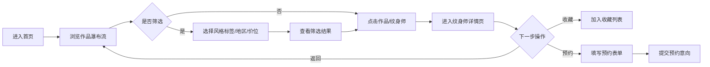

## 1. 产品概述

纹身师风格图谱与预约意向匹配平台，连接纹身爱好者与专业纹身师。用户可按风格标签浏览作品、筛选匹配纹身师、收藏心仪艺术家并发起预约咨询；纹身师可展示代表作品、风格标签、所在地和收费标准。

- 核心目标：解决纹身用户找风格匹配纹身师的痛点，降低信息不对称
- 目标用户：纹身爱好者（C端）、职业纹身师（B端展示）
- 市场价值：垂直领域的艺术匹配平台，建立纹身风格图谱数据库

## 2. 核心功能

### 2.1 用户角色
| 角色 | 注册方式 | 核心权限 |
|------|----------|----------|
| 访客用户 | 无需注册 | 浏览作品墙、查看纹身师信息、按标签筛选 |
| 注册用户 | 本地注册 | 收藏纹身师、发起预约咨询、管理收藏列表 |

### 2.2 功能模块
1. **首页/作品墙**：瀑布流作品展示、风格标签云、多维筛选（风格/地区/价位）
2. **纹身师详情页**：个人简介、代表作品画廊、风格标签、地区价位、预约咨询入口
3. **收藏管理页**：已收藏纹身师列表、快速跳转
4. **预约咨询弹窗**：填写意向风格、尺寸、预算、联系方式

### 2.3 页面详情
| 页面名称 | 模块名称 | 功能描述 |
|----------|----------|----------|
| 首页 | 顶部导航 | Logo、风格标签云快捷入口、搜索框、收藏按钮 |
| 首页 | Hero区域 | 平台标语、快速风格筛选入口 |
| 首页 | 风格标签云 | 动态尺寸标签，点击筛选作品 |
| 首页 | 筛选栏 | 地区下拉、价位区间滑块、风格多选 |
| 首页 | 作品瀑布流 | 多列瀑布流展示作品，悬停显示纹身师信息 |
| 纹身师详情页 | 头部信息 | 头像、姓名、地区、简介、收藏按钮 |
| 纹身师详情页 | 风格标签 | 擅长风格标签展示 |
| 纹身师详情页 | 价位信息 | 收费区间展示、计价方式 |
| 纹身师详情页 | 作品画廊 | 网格布局代表作品，点击放大 |
| 纹身师详情页 | 预约按钮 | 打开预约咨询弹窗 |
| 收藏管理页 | 收藏列表 | 卡片式展示已收藏纹身师，支持取消收藏 |
| 预约弹窗 | 表单 | 意向风格、尺寸描述、预算区间、联系方式、备注 |

## 3. 核心流程

用户浏览首页作品瀑布流，通过风格标签云或筛选栏过滤作品，点击作品或纹身师卡片进入详情页，浏览作品画廊后可收藏纹身师或发起预约咨询，填写预约表单提交意向。

## 4. 用户界面设计

### 4.1 设计风格
- **主色调**：深黑 (#0A0A0A) 背景 + 暗红 (#B91C1C) 强调色，契合纹身文化的暗黑艺术气质
- **辅助色**：暖金 (#D4A574) 点缀、石墨灰 (#1F1F1F) 卡片背景
- **按钮风格**：锐利直角边框、悬停发光、微立体按压效果
- **字体**：展示字体使用 "Cinzel" 衬线体（古典庄重），正文使用 "Noto Sans SC"（清晰易读）
- **布局风格**：暗黑画廊风格、卡片悬浮、不对称瀑布流、大量负空间
- **图标风格**：线性lucide图标，统一描边2px，悬停变红

### 4.2 页面设计概述
| 页面名称 | 模块名称 | UI元素 |
|----------|----------|--------|
| 首页 | Hero区域 | 巨大衬线标题、渐隐副文案、暗红分割线、风格快速入口 |
| 首页 | 风格标签云 | 大小随热度变化、悬停暗红发光背景、点击态填充 |
| 首页 | 瀑布流 | 3列布局、图片圆角4px、卡片悬停上浮+暗红边框、作品信息遮罩 |
| 纹身师详情页 | 头部 | 大尺寸圆形头像、金色边框、姓名衬线字体、地区价位信息 |
| 纹身师详情页 | 作品画廊 | 响应式网格、点击lightbox放大、左右切换 |
| 收藏页 | 卡片列表 | 紧凑卡片布局、头像+标签+快速操作 |
| 预约弹窗 | 表单 | 暗黑玻璃拟态、输入框底线样式、红色聚焦态 |

### 4.3 响应式
- Desktop-first 设计，断点 1024px / 768px / 480px
- 桌面端瀑布流3列，平板2列，手机1列
- 移动端标签云转为横向滚动
- 触屏优化：增大点击热区至44px，移除hover依赖的tooltip

